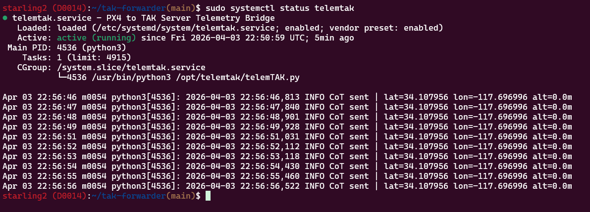
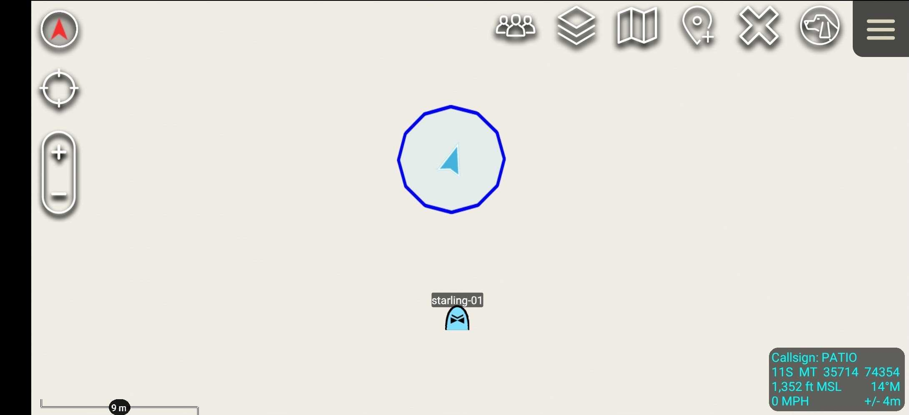
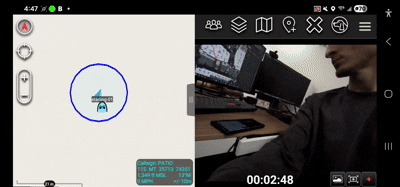

# telemTAK

A lightweight systemd service that bridges PX4 MAVLink telemetry to an OpenTAKServer (OTS) instance over TCP. Designed to run onboard any Linux-based PX4 drone (e.g. Modal AI Starling, VOXL 2) and forward GPS position data as Cursor-on-Target (CoT) XML, allowing the drone to appear as a live icon in ATAK.

---

## Features

- Reads `GLOBAL_POSITION_INT` and `ATTITUDE` from PX4 via pymavlink
- Formats telemetry as CoT XML and forwards to OTS at 1Hz over persistent TCP
- Automatically reconnects to both MAVLink and OTS on link loss
- Watchdog detects stalled MAVLink streams and triggers reconnection
- Rejects zeroed GPS data before a valid fix is acquired
- Runs as a systemd service with `Restart=always`
- Config-file driven — no hardcoded values
- One-command install wizard for deployment on any Linux PX4 drone

---

## Requirements

- Linux-based PX4 drone (tested on Modal AI Starling 2 / VOXL 2)
- Python 3.6+
- pymavlink (`pip3 install pymavlink`)
- OpenTAKServer instance reachable on the same network
- ATAK client connected to the same OTS instance

---

## Installation

```bash
git clone <repo-url>
cd telemtak
chmod +x install.sh
sudo ./install.sh
```

The installer will:
1. Check for and install pymavlink if missing
2. Prompt for MAVLink connection string, TAK server IP/port, drone UID, and callsign
3. Show a confirmation summary before making any changes
4. Copy the script to `/opt/telemtak/`
5. Write the config to `/etc/telemtak/config.ini`
6. Install, enable, and start the systemd service

---

## Configuration

Config is stored at `/etc/telemtak/config.ini` and written by the installer. To modify after installation:

```ini
[mavlink]
connection_str = udp:127.0.0.1:14551

[tak]
host = 192.168.1.195
port = 8088

[drone]
uid = drone-001
callsign = VOXL-01
```

After editing manually, restart the service:
```bash
sudo systemctl restart telemtak
```

After a successful start-up, the service status should appear as such:
<p align="center">
  
</p>

On an ATAK user's end the drone should appear as this icon:
<p align="center">
  
</p>

Video streaming (WIP)


Or use the built-in config updater which prompts with current values as defaults and restarts automatically:
```bash
sudo ./install.sh --config
```

---

## MAVLink Port Notes

telemTAK connects to MAVLink locally on the drone. The correct port depends on your `voxl-mavlink-server` configuration:

- `udp:127.0.0.1:14551` — default GCS port for this Modal AI drone
- If that port is in use, add a dedicated output in `/etc/modalai/voxl-mavlink-server.conf` pointing to `127.0.0.1` on a free port (e.g. 14560) and restart with `voxl-restart voxl-mavlink-server`

---

## Service Management

```bash
systemctl status telemtak        # check service status
journalctl -u telemtak -f        # live log stream
systemctl restart telemtak       # restart service
systemctl stop telemtak          # stop service
systemctl disable telemtak       # disable autostart on boot
```

---

## CoT Type

The drone appears in ATAK as a friendly military rotary-wing quadrotor:

```
a-f-A-M-H-Q
│ │ │ │ │ └── Q = Quad rotor
│ │ │ │ └──── H = Rotary wing
│ │ │ └────── M = Military
│ │ └──────── A = Air
│ └────────── f = Friend
└──────────── a = Atom
```

Change `M` to `C` for civilian if needed: `a-f-A-C-H-Q`

---

## Repo Structure

```
telemtak/
├── telemTAK.py          # main service script
├── telemtak.service     # systemd unit file
├── config.ini           # config template
├── install.sh           # installation wizard
└── README.md
```

---

## Roadmap

- [ ] Video streaming service (`px4tak-video.service`) via GStreamer/RTSP to ATAK video plugin
- [ ] Attitude data (pitch, roll, yaw) included in CoT detail block
- [ ] Battery level forwarded as CoT sensor data
- [ ] SSL/TLS support for encrypted OTS connections